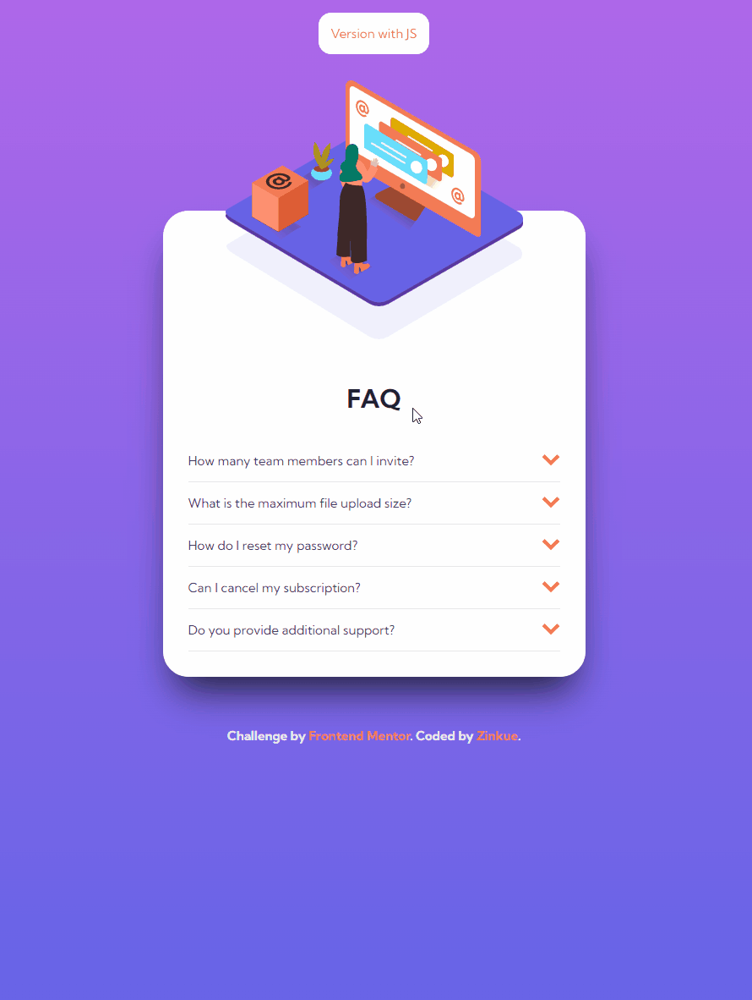

# Frontend Mentor - FAQ accordion card solution

This is a solution to the [FAQ accordion card challenge on Frontend Mentor](https://www.frontendmentor.io/challenges/faq-accordion-card-XlyjD0Oam). Frontend Mentor challenges help you improve your coding skills by building realistic projects. 

## Table of contents

- [Overview](#overview)
  - [The challenge](#the-challenge)
  - [Screenshot](#screenshot)
  - [Links](#links)
- [My process](#my-process)
  - [Built with](#built-with)
  - [What I learned](#what-i-learned)
  - [Continued development](#continued-development)

## Overview

### The challenge

Users should be able to:

- View the optimal layout for the component depending on their device's screen size
- See hover states for all interactive elements on the page
- Hide/Show the answer to a question when the question is clicked
- **Bonus**: Complete the challenge without using JavaScript

### Screenshot



### Links

- [Solution URL](https://zinkue.github.io/Faq-accordion-card/)

## My process

### Built with

- Semantic HTML5 markup
- CSS custom properties
- Flexbox
- CSS Grid
- Mobile-first workflow
- Animation with JS
- Display/hide elements with HTML/CSS only

### What I learned

```css
.question-checkbox:checked + .question .question-text {
    font-weight: 700;
}
```
```js
function getAnswer(element) {
    const id = element.target.id == "" 
        ? element.target.parentElement.id
        : element.target.id;
```

### Continued development

I found very powerful the HTML checkbox elemnet:
```html
<input type="checkbox">
```
to animate/show other elements in the web witout the use of JS.

Also I want to understand better, for my future projects, the CSS selectors.
